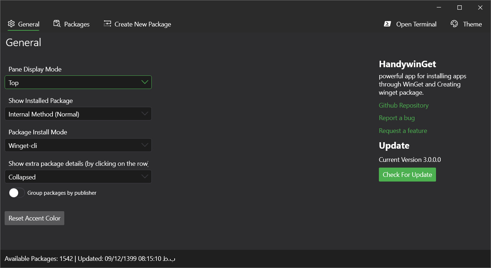
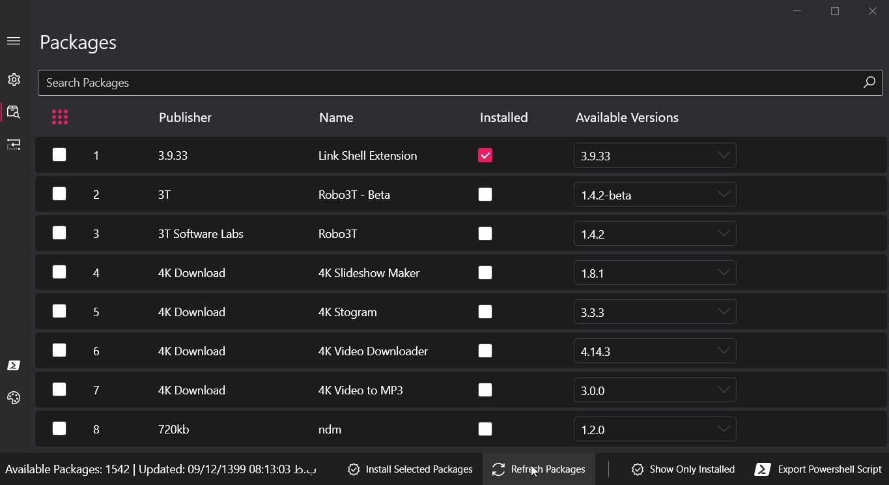
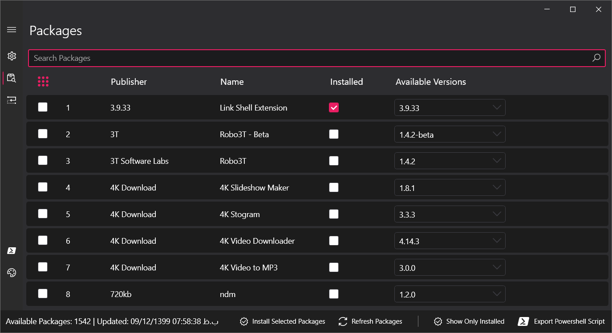
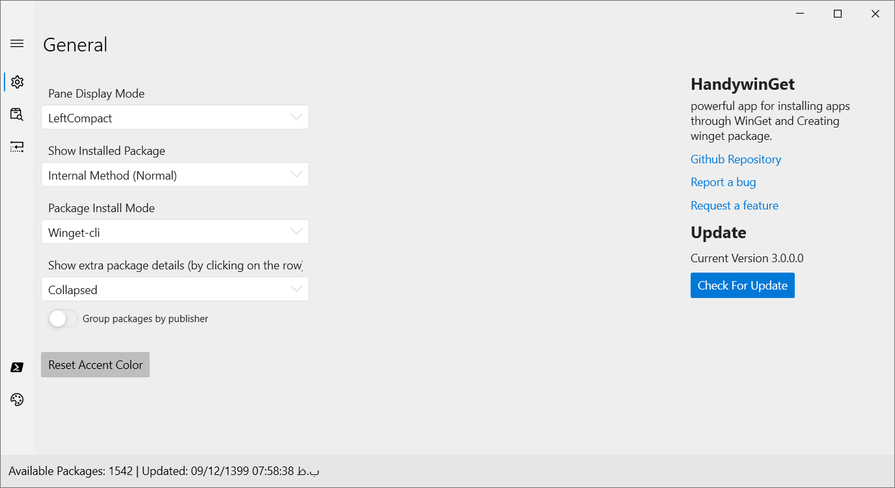
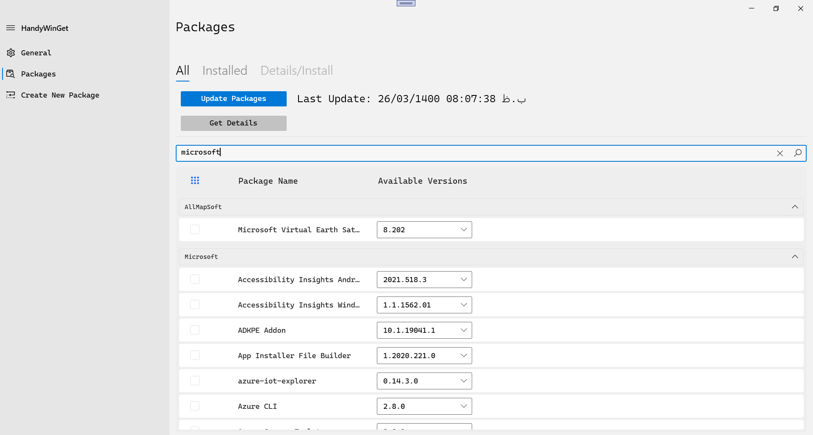
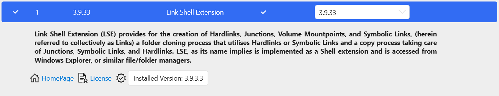
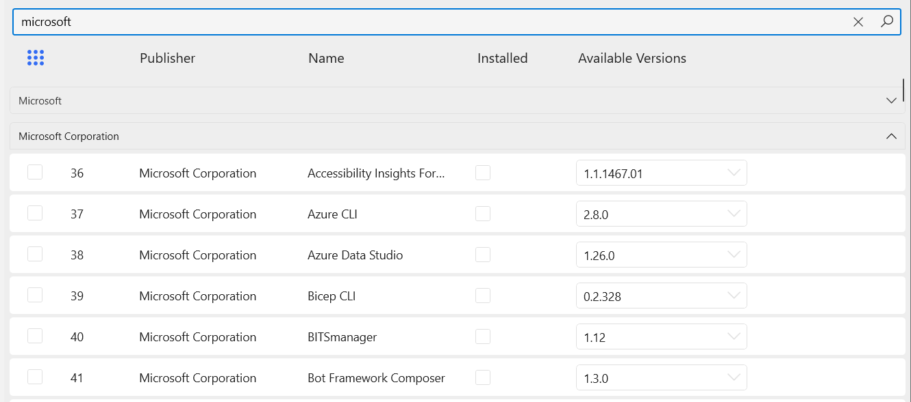
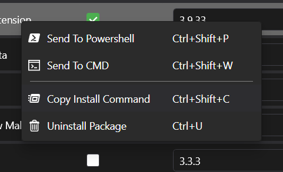

# HandyWinGet
 

	<b>🙌 Use <a href="https://blockchain.com/btc/payment_request?address=19cmmVkh4ZsEdrcumbRMvQXmCFfw8nAbX5&amount=0.00041825&message=Buy a cup of tea">donations</a> to help support <b>your</b> projects! 🙌</b>

  
provides a GUI for installing apps with or without WinGet.

 Version 4 Features:

- Redesigned user interface
- Auto Download Packages
- Upgrade Packages
- Very fast and flexible
- Search between packages
- Customizable user interface 
- View Multiple Packages Details
- Group Packages by Publisher
- Uninstall Installed Packages
- Install Multiple Packages
- Export PowerShell Script
- Install Packages via Terminal or Other Options
- No need for winget cli
- No need for Windows 10 
- Windows 7 Supported
- Support Internal Downloader and Winget-cli
- Ability to download with Internet Download Manager (IDM)
- Ability to install different versions
- Ability to recognize Installed Packages
- Powered by .NET 5
- Create Package
- Light/Dark Theme

## Installing and running HandyWinGet
you can download latest setup from GitHub [Release](https://github.com/HandyOrg/HandyWinGet/releases) or download and install Via Winget

run the following command from the command line / PowerShell:
`WinGet install handywinget`

