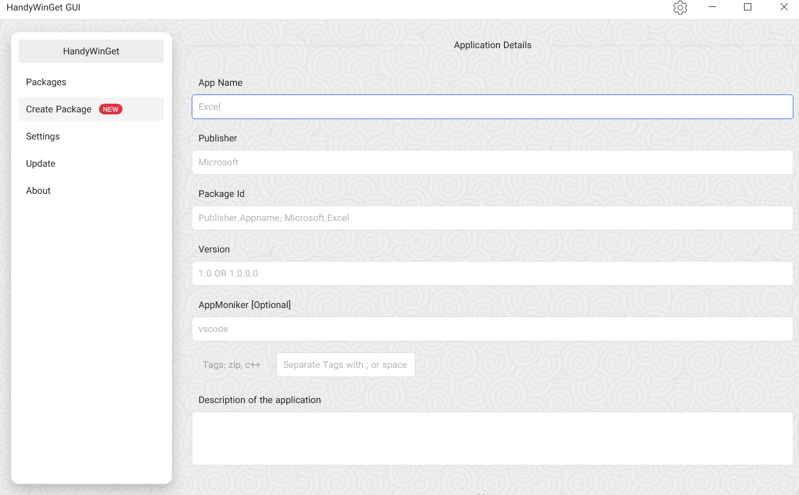

# HandyWinGet-GUI
 
provides a GUI for installing apps through WinGet.

- Install Packages
- Recognize Installed Packages
- Create Packages
- .Net Core 3.1
- Prism MVVM
- Multi Language
- Light/Dark Theme

Check out the Releases to download.

