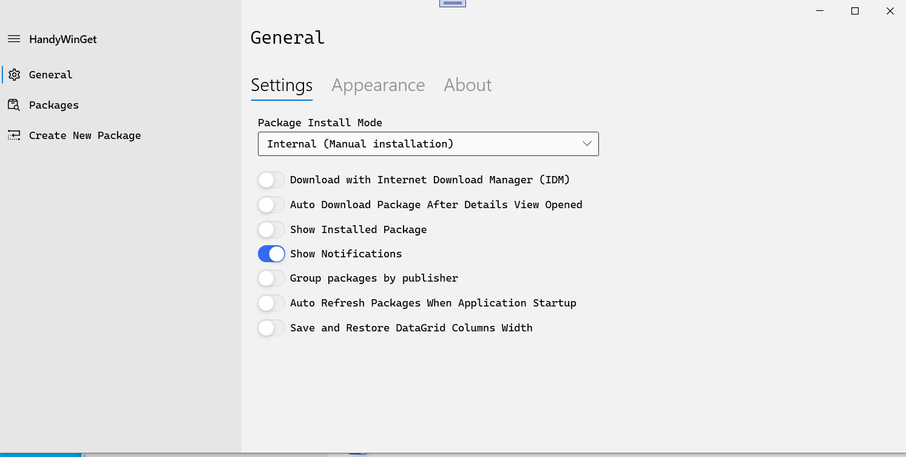
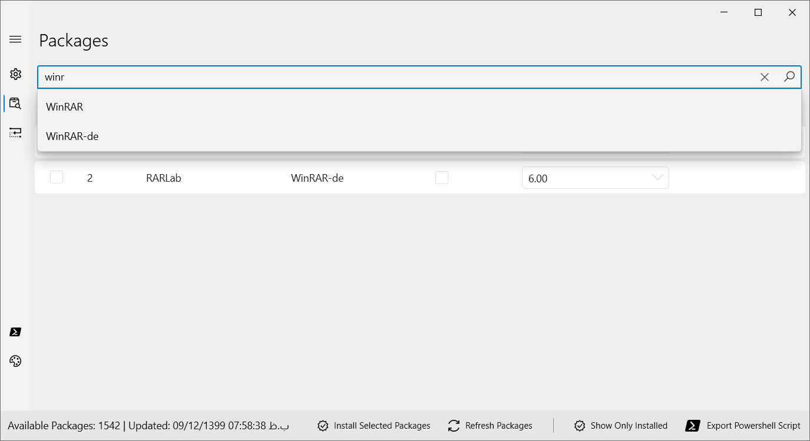
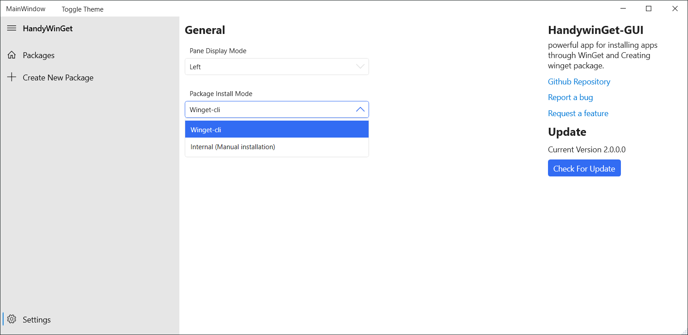
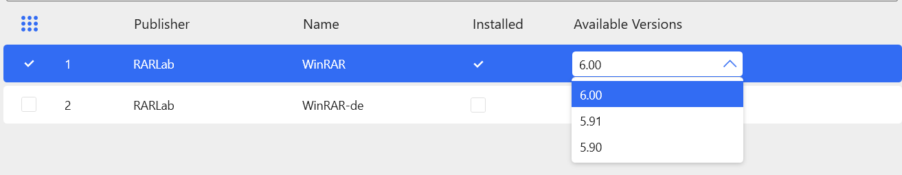
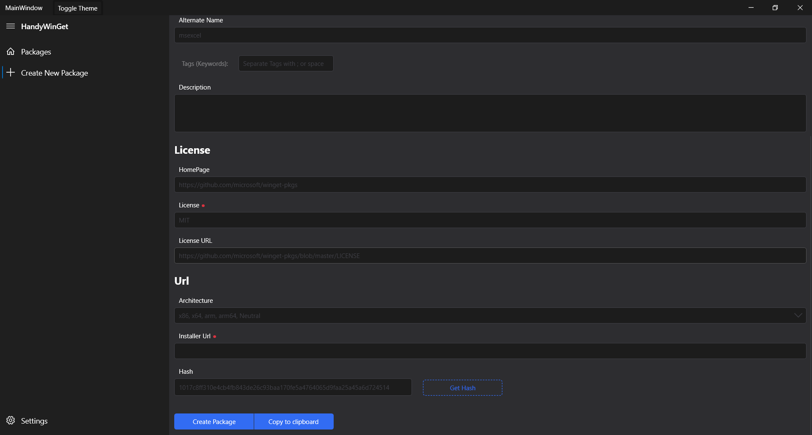

# HandyWinGet-GUI
 
provides a GUI for installing apps through WinGet.

`Version 2: Completely rebuilt`
- No need for winget cli
- No need for Windows 10 (Older versions of Windows are supported (If .NET 5 is supported on Windows, HandyWinget is also supported))
- Support Internal Downloader and Winget-cli
- Ability to download with Internet Download Manager (IDM)
- Ability to cache data and no need to download all information
- Redesigned user interface
- Ability to install different versions
- Ability to delete and update programs (Not completed yet)
- Ability to recognize Installed Packages (Not completed yet)
- Faster than Version 1
- Powered by .NET 5
- Create Package
- Light/Dark Theme
- New Navigation Menu
- Prism MVVM

## Version 2 Release Date: Unknown, [beta version available](https://github.com/HandyOrg/HandyWinGet-GUI/releases)

`Version 1:`
- Install Packages
- Recognize Installed Packages
- Create Packages
- .Net Core 3.1
- Prism MVVM
- Multi Language
- Light/Dark Theme

## Installing and running HandyWinGet-GUI
you can download setup from GitHub [Release](https://github.com/HandyOrg/HandyWinGet-GUI/releases) or download and install Via Winget
To install HandyWinGet-GUI, run the following command from the command line / PowerShell:
`WinGet install handywinget`

